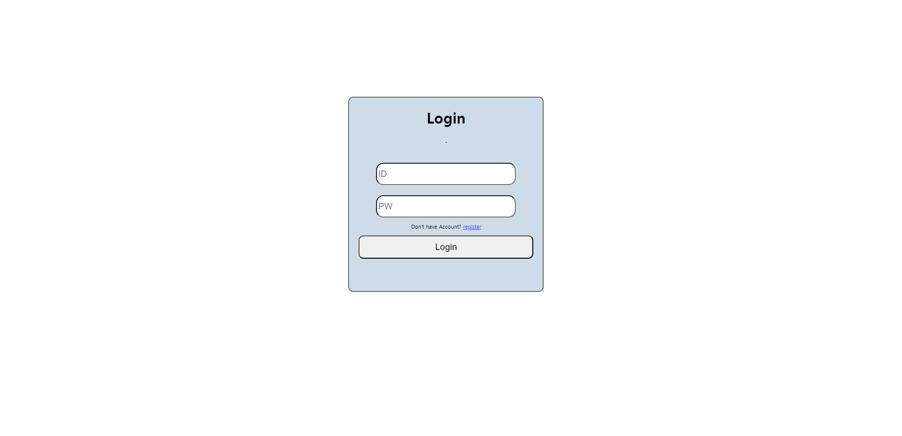
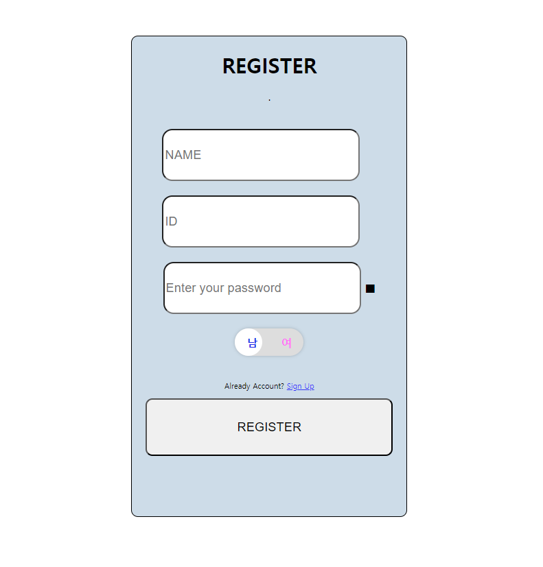
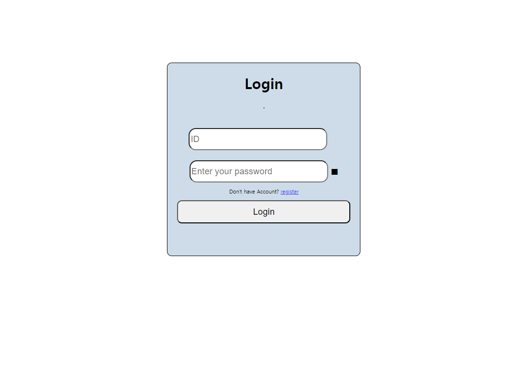
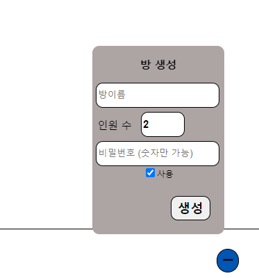
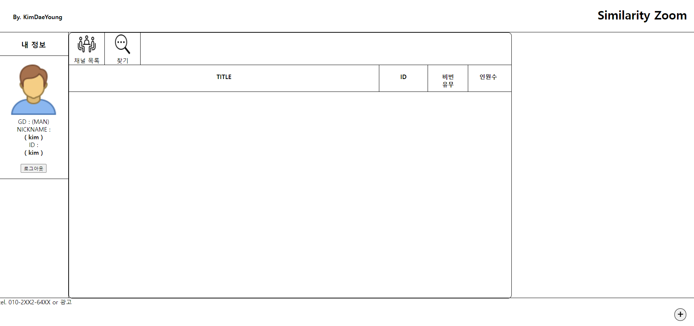
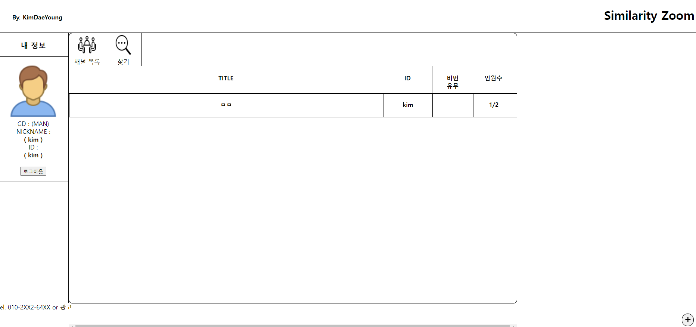
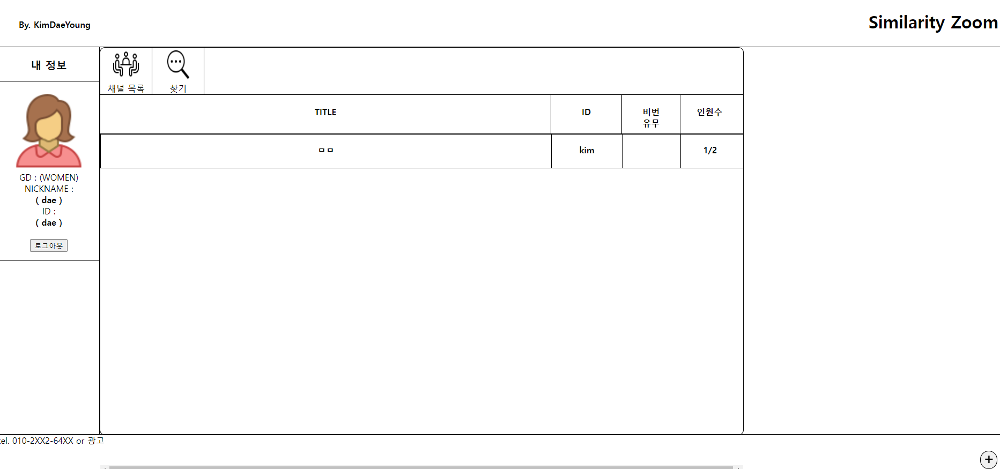
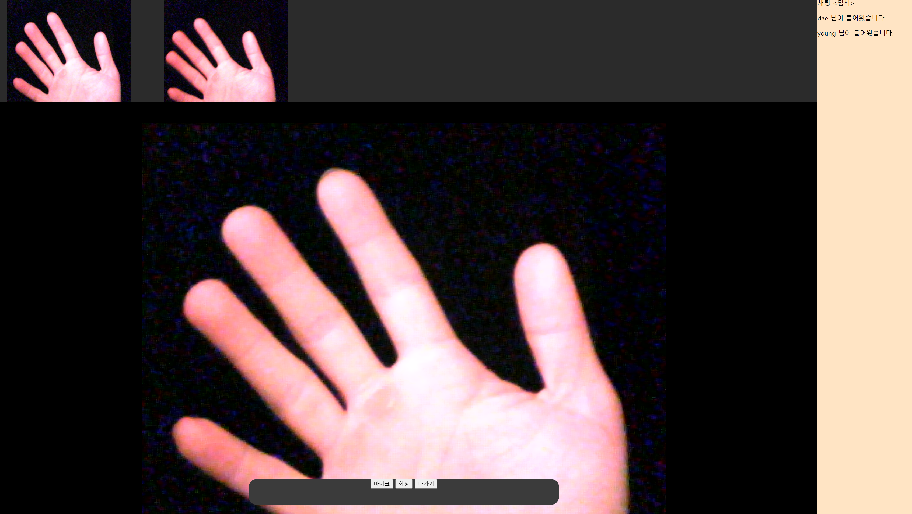

# SIMILARITY_ZOOM

## 1차
- 프론트
    - 로그인 창 구현
    
    - 회원가입 창 설정
    - 메인 창 설정
    - 채팅 창 설정
- 백엔드
    - 각 이동 기능 구현 (DB X)

---------------------------------------------

## 2차
- 프론트 
    - 회원가입 창 구현 
        - (이름, ID, PW, 성별)
        
    - 로비 창 구현 (80%)
        - 방 만들기
        
        
- 백엔드
    - 회원가입 버튼 기능 추가
    - 데이터베이스 설계 (user_info)
    - DB API 구현 및 프론트 연결

---------------------------------------------

## 3차
- 백엔드
    - 방 생성 기능을 제작
        - socket으로 webRTC제작으로 방 생성
            - A :  => 
            - B : 
        - 상대방에게 방 목록이 남으며, 현 인원수 와 최대 인원수 진입까지 구현

---------------------------------------------

## 4차
- 백엔드
    - socket을 이용한 채팅방 인원 제한 및 방장 나갈시 다 같이 나가며, 방이 사라지도록 제작
    - 방장을 기준으로 새로운 사용자가 나타나면 sub으로 작은 영상을 틀어줄 수 있게 나옴
    - 1:N으로 화상통신 가능 
     
- 프론트
    - 작은 sub video를 새로운 사용자가 들어올때 마다 동적으로 생성 및 삭제됨
    - 사용자가 들어오거나 나갈때 알람판에 표시됨
    - 나가기 버튼 생성